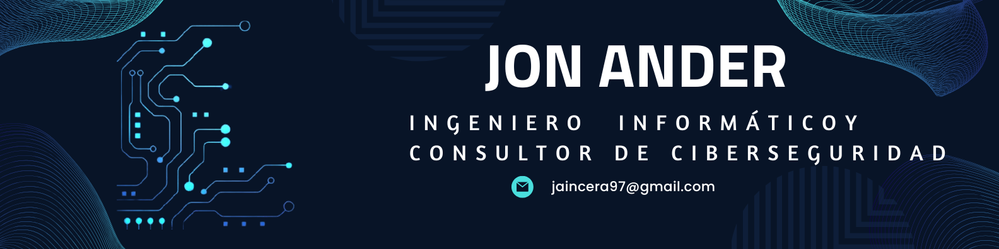

<h1 align="center">Hola, soy Jon Ander</h1>

  

🧑‍💻 Acerca de mí

Hola, me llamo Jon Ander y soy un apasionado de la tecnología y la informática.

Mi camino comenzó con un Grado Superior en Administración de Sistemas Informáticos en Red (ASIR), donde adquirí una sólida base técnica. Más adelante, decidí seguir formándome en la universidad, donde amplié mis conocimientos en programación y desarrollo, trabajando con lenguajes como C, Java, Python.

Actualmente trabajo como consultor de ciberseguridad, ayudando a empresas a proteger sus activos digitales y cumplir con normativas como ISO 27001, el Esquema Nacional de Seguridad (ENS) y la directiva NIS2. Me apasiona lo que hago, y me motiva seguir creciendo en este ámbito en constante evolución.

Por eso, mi próximo objetivo es estudiar un máster en ciberseguridad que me permita especializarme aún más y afrontar nuevos retos profesionales con mayor preparación.

<h2>Contacto</h2>
<a href="mailto:ossinsight@pingcap.com" target="_blank">

